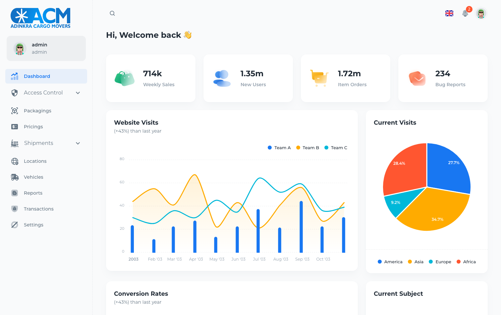
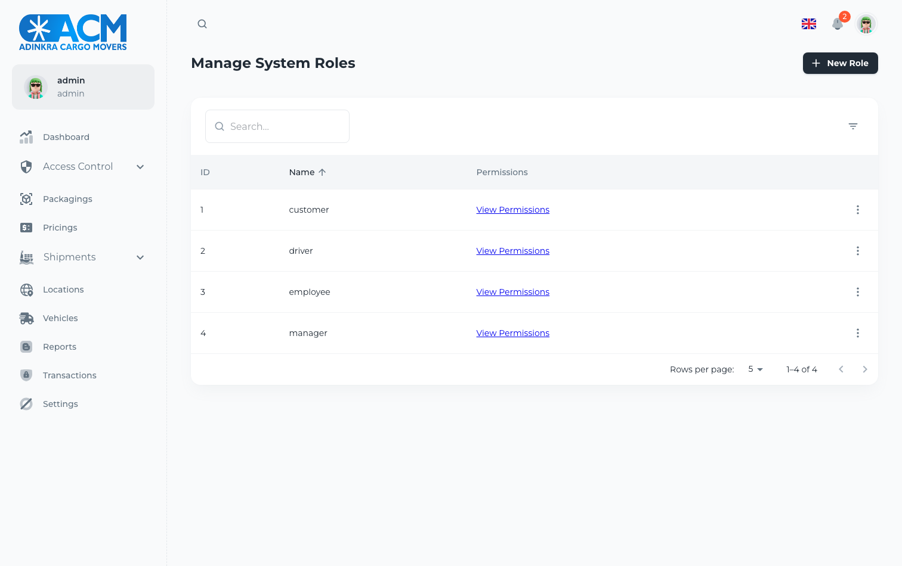

# Adinkra Console

The operator console for a cargo and logistics business — shipments, parcels,
packagings, pricing, vehicles, locations and user administration. React 18 with
MUI, Redux Toolkit, Formik. About 15,500 lines.

It talks to [the Adinkra API](../Adinkra-BE).


## Running it

```bash
cp .env.example .env      # API url, and a Google Maps key if you want maps
docker compose up --build # http://localhost:3010
```

The API needs to be running first — see the backend's README. Sign in with
`admin@example.com` / `Helloworld`.

## What was wrong

### Signing in did not work

The login request succeeded — a clean `200` with a token — and the app returned
to the login screen. It did that every time.

Two things were fighting each other.

`persistStore(store)` was being called **inside the component body**:

```jsx
export default function App() {
  let persistor = persistStore(store);
```

so a new persistor was built on every render, and each one dispatched a fresh
`REHYDRATE` carrying the empty state read from disk — overwriting the session
that had just been stored.

Then, immediately after storing the session, login did a hard page reload:

```jsx
dispatch(storeUser(user));
// router.replace('/');          <- the client-side navigation, commented out
window.location.replace('/');
```

Redux-persist writes asynchronously. Tearing the page down in the same tick
discarded the write. The commented-out line above it is the version that would
have worked.

The persistor is created once at module scope now, and login waits for the
write to land before navigating.



### The signed-in user was someone else

The account panel in the sidebar read from `src/_mock/account.js` — the MUI
template's demo persona, "Jaydon Frankie" — no matter who was actually signed
in. It reads the session now.

### The Google Maps key was hardcoded

It sat in `public/index.html`, committed. Maps keys are *meant* to be public —
they ship in the page and there is no way around that — but they are billed to
whoever owns them, so an unrestricted one in a public repo is somebody else's
invoice. It comes from the environment now, and `.env.example` says to restrict
it by domain in the Google console.

### A branch that could not be taken

```js
if (moment(new Date()).isBefore(moment().add(1, 'minute'))) {
  config.headers.Authorization = `Bearer ${accessToken}`;
} else {
  config.headers.Authorization = `Bearer ${accessToken}`;
}
```

Now is always before a minute from now, and both branches do the same thing.
It is a placeholder for token refresh — the comment beside it says "waiting for
the backend service". Left as is and labelled, because the refresh endpoint it
is waiting for does exist now that access tokens expire; wiring it up is a
feature, not a repair.

## Worth knowing

**The dashboard is the template's.** Weekly Sales, Website Visits, Bug Reports,
Team A/B/C — that is the MUI Minimal starter's demo data, not this business's.
Every other screen is real: the tables below are the API's own records.



The screens that read live data — users, roles, locations, vehicles, pricing,
shipments — all work against the API.

## Layout

```
src/
  api/            axios wrapper: useQuery, useMutation, useLazyQuery
  sections/       one folder per screen
  layouts/        dashboard shell and navigation
  routes/         public and protected route trees, permission gating
  state/          Redux Toolkit slices and the persisted store
  components/     shared UI
```
